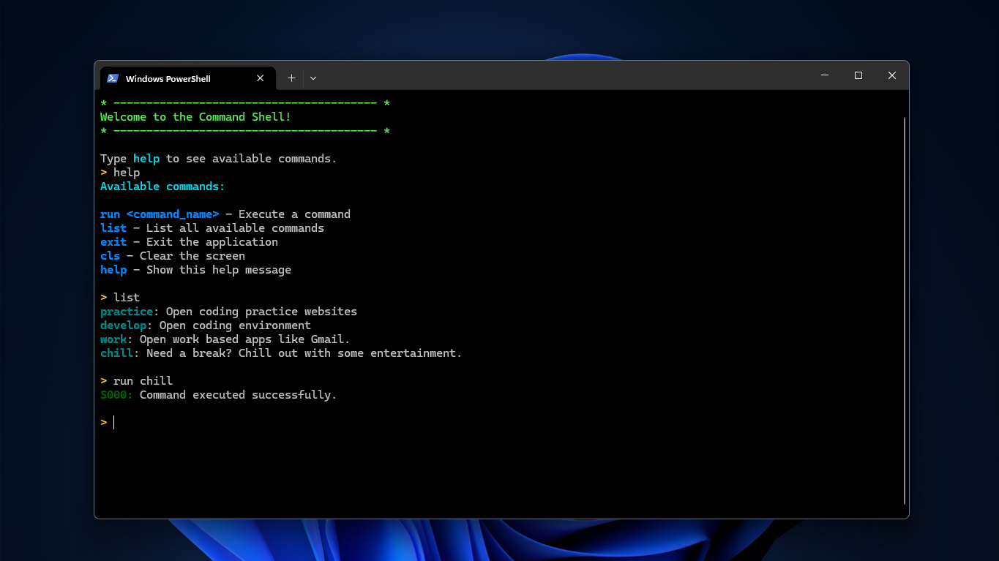

# 🎍 dock.cmd

A lightweight personal command shell built for PowerShell that launches through `app.py`.

It provides a custom terminal interface for executing predefined commands and includes optional automation through AutoHotkey.


## Overview

`dock.cmd` acts as a wrapper command environment that simplifies repetitive terminal interactions.

Instead of manually typing recurring commands, users can launch a controlled shell with predefined command handling.


## Features

- Custom PowerShell command shell
- Launches through `app.py`
- Predefined command parsing
- Built-in command help menu
- AutoHotkey integration for quick launch
- Error handling with status codes

## Installation

Clone the repository:
``` bash
git clone <repo-url>
cd <repo-name>
```

Install dependencies:
``` bash
pip install -r dependency.txt
```

## Running the shell

Start the terminal environment:
``` bash
python app.py
```

Use:
``` bash
help
```
to display the available commands.



## AutoHotkey Integration

`dockcmd.ahk` allows launching the terminal instantly using `ALT + Q`.  
This is useful for minimizing manual start-up steps.  
Compile the script using AutoHotkey (latest) and add the compiled script it to your startup apps.  
#### How to add compiled script to startup app?
Open `WIN + R` (run):
``` shell
shell:startup
```

## Status Codes

### Success
| Code | Description |
| :--: | :---------- |
| 000  | No errors or warnings |

### Error
| Code | Description |
| :--: | :---------- |
| 400  | Unknown terminal command |
| 404  | Resource/Command not found |


