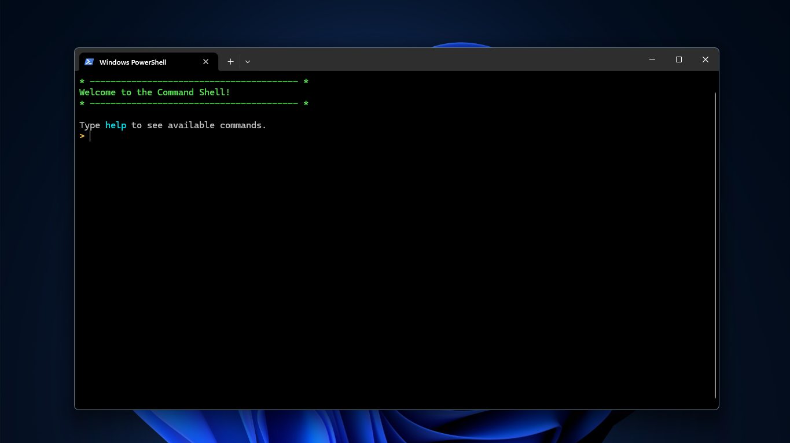

# 🎍 dock.cmd 🎍

This is a personal command shell to be used in powershell on run of `app.py`. Set of commands can be displayed using help.

A autohotkey script `dockcmd.ahk` is provided for automated usage of terminal upon `Alt + Q`.

### <mark>Messages:
#### Success (S):
- 000: No errors or warning triggers.

#### Error (E):
- 400: Unknown terminal command.
- 404: Not Found.